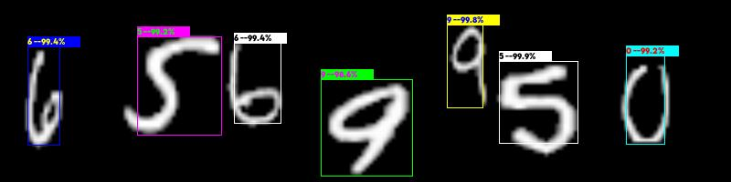
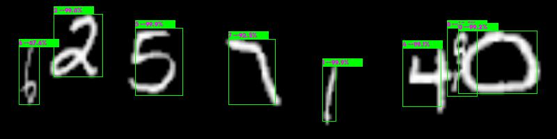
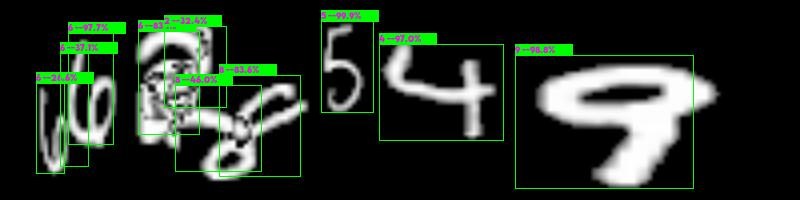

# object_detection

A simple implementation of Yolo.

There is a simple MNIST yolo and COCO yolo, which are trained on a generated detection dataset using MNIST and COCO dataset.

yolo_colab.ipynb can be run in Colab

## Example images in MNIST yolo:

Everything is from example_images folder

